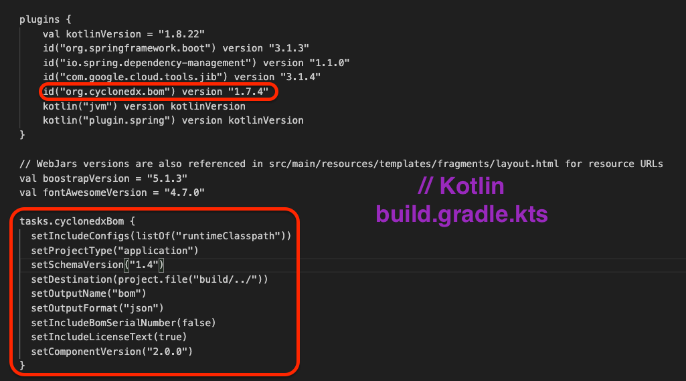
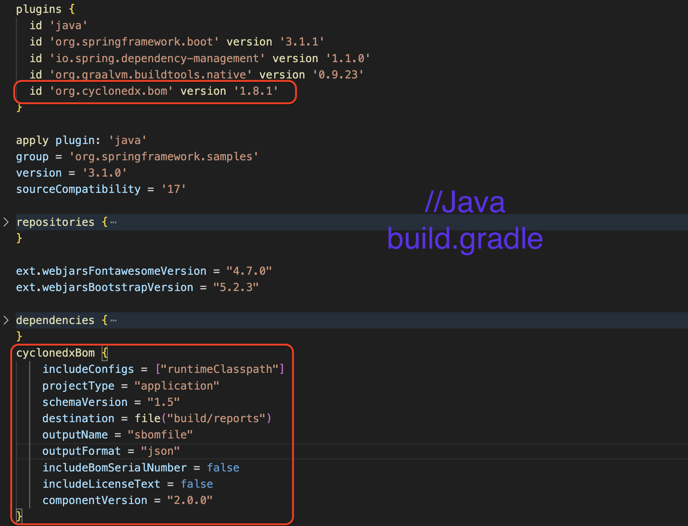

# Integrating CycloneDX in a Gradle Project for SBOM Generation and Scanning


The Software Bill of Materials (SBOM) is essential in cybersecurity, offering detailed insights into all components of a software build. This includes not only the primary software but also third-party and transitive dependencies. SBOMs play a crucial role in identifying hidden risks and addressing potential security threats.

*For insights on SBOM with maven projects and its importance, refer to our [SBOM 101 blog](https://kondukto.io/blog/sbom-software-bill-of-materials).*

CycloneDX is an open-source initiative that focuses on creating a standardized format for SBOMs, enhancing the security of software supply chains. It simplifies the process of generating SBOMs, allowing for a more thorough assessment of vulnerabilities in dependencies. This project demonstrates the use of CycloneDX with Gradle plugins to create SBOMs for a build.gradle.kts and build.gradle files.

*To view the related blog post for this repository, please visit [this link](https://kondukto.io/blog/how-to-generate-and-audit-sbom-in-a-ci-cd-pipeline).*

## Adding CycloneDX Plugin to Gradle

### For Groovy (`build.gradle`):

Add the following to your `build.gradle`:

```groovy
plugins {
    id 'org.cyclonedx.bom' version 'x.y.z'
}
```

Replace `x.y.z` with the desired version of the CycloneDX plugin.

### For Kotlin (`build.gradle.kts`):

Add the following to your `build.gradle.kts`:

```kotlin
plugins {
    id("org.cyclonedx.bom") version "x.y.z"
}
```

After adding plugins, you can add/edit the tasks of plugins on the build process to generate the SBOMs accordingly on the customized target destination as shown in the following screenshots.

*To check CycloneDX plugin on gradle, you can have a look at [this link](https://plugins.gradle.org/plugin/org.cyclonedx.bom). You can also achieve tasks to use on your build file [here](suggested-tasks-in-buildgradle.txt)*





## Generating SBOM on the build process

After integrating CycloneDX, we use 'gradle cyclonedxBom' command to generate the SBOM:

```bash
gradle cyclonedxBom
```

This command creates an SBOM in CycloneDX JSON format on the directory mentioned in the tasks of the plugin inside build.gradle or build.gradle.kts.

## Scanning SBOM with osv-scanner

OSV-scanner, a CLI tool, checks for open-source vulnerabilities in SBOM files. To scan your SBOM and find vulnerabilities, use:

```bash
osv-scanner -S sbom.json --json --output result.json
```
You should also keep in mind that if you find any vulnerabilities on your scan, the OSV scanner will have a return value of “1”. Using it in a pipeline, as a result of return 1, your pipeline will break. Therefore, if you want to use it without breaking the pipeline, following your osv scan, you can use the || true operand as shown in the following.

```bash
osv-scanner -S sbom.json --json --output result.json || true
```


## Importing SBOM and Scan Results into a Pipeline

Kondukto, an Application Security Orchestration and Posture Management (ASPM) platform, streamlines vulnerability management. Utilize Kondukto's kdt CLI tool to import vulnerabilities and scan results into your pipeline, thereby enhancing cybersecurity management efficiency. In this pipeline, we generate SBOM scan it within the pipeline using the osv-scanner binary, and import SBOM and scan results one by one to the the Kondukto using kdt. You can check the pipeline inside .github/workflows/build.yaml.


---
